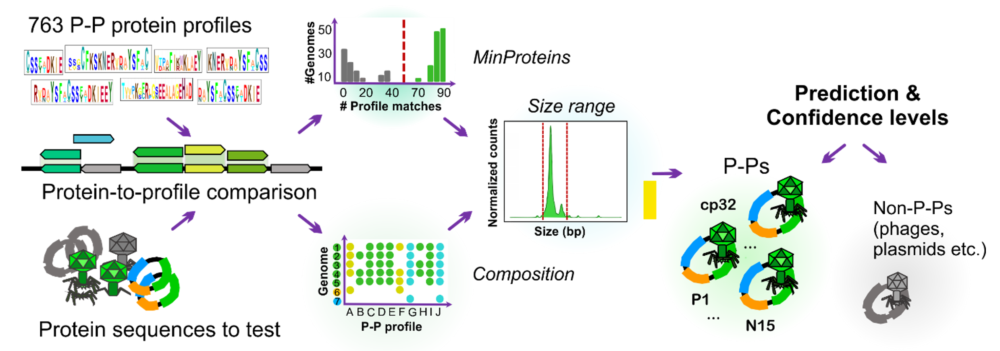
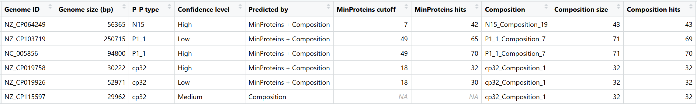
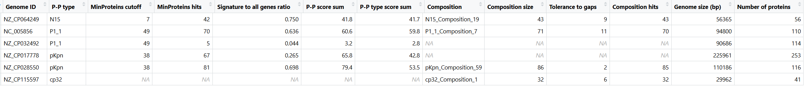

# Introduction

**tyPPing** is a fast, sensitive, and accurate R-based pipeline designed to detect and type phage-plasmids (P‑Ps) in bacterial genomes.\
It uses a curated set of HMM protein profiles trained on well‑characterized P‑Ps from the most prevalent types.\
These profiles allow tyPPing to search for conserved signatures, classify new elements, and assign a confidence score (**High**, **Medium**, or **Low**) to each prediction.\
This helps users quickly identify new putative P‑P and interpret the predictions.

Currently, tyPPing can detect the following P‑P types:

**AB_1, P1_1, P1_2, N15, SSU5_pHCM2, pMT1, pCAV, pSLy3, pKpn, and cp32.**

The pipeline works with both **complete** and **draft genomes**, using two dedicated scripts:

-   **`tyPPing.R`** – for complete genomes\
-   **`tyPPing_for_draft_genomes.R`** – for draft genomes (contigs or MAGs).

## Pipeline overview

**Figure guide**



**Step 1. Protein search**

Use **HMMER** (`hmmsearch`) to compare your multi-protein FASTA file against the provided P‑P type‑specific profiles. This step performs a protein-to-profile comparison and generates an output table using the `--domtblout` option.

**Step 2. Run tyPPing (R script)**

The tyPPing script processes the `--domtblout` output by two analytical branches:

-   **MinProteins**: counts the number of highly conserved proteins in a given element, and keeps only sequences that pass a minimal threshold number.
-   **Composition**: only elements matching unique combinations of the conserved proteins are kept.

These two metrics are combined with genome size information to assign each genome a predicted P‑P type and a confidence score (**High**, **Medium**, or **Low**). The results are summarized in `Final_prediction_table.tsv`.

# Usage

## Tool setup & installation

**tyPPing** is an R script and does not require installation. To use it, **clone or download the repository**.

1.  **Dependencies:**

    -   **HMMER** installed (for `hmmsearch`) [REF]

    -   **R** installed (version ≥ 4.0) [link]

    -   "rhmmer" R package installed (not available on CRAN) [link]:

        ```{r eval=FALSE, include=FALSE}
        devtools::install_github('arendsee/rhmmer')
        ```

2.  **Folder structure:**

    The **`tyPPing/`** folder contains the main scripts, input tables, and example data:

    ```{bash eval=FALSE, include=FALSE}
    tyPPing/
    ├── tyPPing.R                    # Main script for complete genomes
    ├── tyPPing_for_draft_genomes.R  # Script for draft genomes (e.g., MAGs)
    ├── tyPPing_input_data/
    │   ├── Cutoffs_information_table.tsv      # tyPPing score thresholds 
    │   ├── Compositions_information_table.tsv # Profile composition sets per P-P type
    │   └── Profile_information_table.tsv      # Annotation information (used by tyPPing)
    ├── small_example_test_data/     # Includes example input/output for 20 genomes
    ```

## Input data requirements

**1. For HMM search (Step 1):**

-   A multi-protein FASTA file, sutable for the hmmsearch (e.g. `proteins.fasta`)

-   P-P type specific HMM profiles `tyPPing_signarture_profiles.hmm`.

    ***Important:*** `tyPPing_signarture_profiles.hmm` can be downloaded from [<https://zenodo.org/uploads/add_valid_link>]

**2. For tyPPing scripts (Step 2):**

To run `tyPPing.R` (for complete genomes) or `tyPPing_for_draft_genomes.R` (for draft genomes), you will need:

-   HMMER output table from `--domtblout` command (Step 1)

-   tyPPing input tables (provided in `tyPPing_input_data/` folder)

-   A protein-to-genome mapping file (generated by user, example below)

-   Genome size file (generated by user, example below).

## **Running tyPPing**

#### 1. Search for P-P specific proteins in target genomes

Run `hmmsearch` (HMMER) to scan the protein sequences of target genomes (e.g., `proteins.fasta`) against the P‑P type‑specific profile HMMs (`tyPPing_signarture_profiles.hmm`). For more detailed documentation on HMMER see [REF].

Example command:

```{bash eval=FALSE, include=FALSE}
hmmsearch -o tmp.all.out --domtblout hmm_search_for_tyPPing.tbl.out tyPPing_signarture_profiles.hmm proteins.fasta
```

#### 2. Prepare the input files

tyPPing requires simple input tables in TSV or CSV format:

-   **Protein‑to‑genome** mapping file (e.g. `protein_to_genome.tsv`). This table links each protein ID to its corresponding genome. It must have 2 columns named:

    -   `protein_id` – protein identifier used in the FASTA and HMMER output

    -   `genome_id` – genome identifier for the protein.

    Example table:

    | protein_id | genome_id |
    |------------|-----------|
    | NP_052607  | NC_002128 |
    | NP_052608  | NC_002128 |
    | NP_052609  | NC_002128 |
    | NP_052610  | NC_002128 |
    | ...        | ...       |

-   **Genome size** file (e.g. `genome_size.tsv`). This table contains the genome size in base pairs. It must have 2 columns named:

    -   `genome_id` – genome identifier

    -   `size` – genome size in base pairs (bp).

    Example table:

    | genome_id | size  |
    |-----------|-------|
    | NC_002128 | 92721 |
    | NC_005856 | 94800 |
    | NC_006509 | 47890 |
    | NC_015465 | 33004 |
    | ...       | ...   |

Once these two files and the --domtblout HMMER output are ready, you can proceed to run the tyPPing script.

#### 3. Run the tyPPing script\*\*

You can run **`tyPPing.R`** (for complete genomes) or **`tyPPing_for_draft_genomes.R`** (for draft genomes) in two ways:

#### **A. Interactive mode (RStudio):**

```         
-   Update all file paths in the script to match your local directory structure (see the script for guidance).

-   Run the script.
```

**B. Command‑line mode:**

```{bash}
    Rscript tyPPing.R\    # or tyPPing_for_draft_genomes.R
    --map path/to/protein_to_genome.tsv \
    --sizes path/to/genome_size.tsv \
    --hmm_domtbl path/to/all_pers_hmm_plasmids_0523_out.tbl.out \
    --outdir path/to/output_dir/ \
    --compositions path/to/Compositions_information_table.tsv \
    --profiles path/to/Profile_information_table.tsv \
    --cutoffs path/to/Cutoffs_information_table.tsv
```

**Command‑line arguments:**

-   **`-m, --map`** – path to the *protein‑to‑genome* mapping table.

-   **`-s, --sizes`** – path to the *genome size* table.

-   **`-i, --hmm_domtbl`** – path to the HMMER `--domtblout` file (`*.tbl.out`).

-   **`-o, --outdir`** – path to the *output* directory.

-   **`--compositions`** (default in: `tyPPing_input_data/Compositions_information_table.tsv`) – contains profile composition sets for each P‑P type.

-   **`--profiles`** (default in: `tyPPing_input_data/Profile_information_table.tsv`) – contains profile metadata, functional annotations, and mapping between HMM IDs and P-P types.

-   **`--cutoffs`** (default in: `tyPPing_input_data/Cutoffs_information_table.tsv`) – thresholds used by the MinProteins and Composition branches (per P‑P type).

## Standard output summary tables

tyPPing generates **two main output tables**:

**1. `Final_prediction_table.tsv`**

This table contains the **final predictions** for elements detected by at least one branch (**MinProteins** and/or **Composition**) and includes confidence levels for each assignment.



**Column descriptions:**

-   **Genome ID** – unique identifier of the analyzed genome.
-   **Genome size (bp)** – total size of the genome, in base pairs.
-   **P-P type** – the predicted phage-plasmid (P-P) type assigned to the genome.
-   **Confidence level** – prediction confidence (**High**, **Medium**, or **Low**) based on the number of branches supporting the result and genome size.
-   **Predicted by** – branch or branches that led to the prediction.
-   **MinProteins cutoff** – minimum number of required protein hits for a confident match to the P-P type.
-   **MinProteins hits** – number of signature proteins detected by the **MinProteins** branch.
-   **Composition** – composition pattern ID (set of signature profiles) matched for the P-P type.
-   **Composition size** – total number of signature profiles in the defined composition set.
-   **Composition hits** – number of composition-specific profiles found in the genome by the **Composition** branch.

**2. `All_hmm_hits_table.tsv`**

This table lists **all HMM hits** (not just confident predictions). Useful for inspection of intermediate data or investigate borderline cases.



-   **Genome ID** – unique identifier of the analyzed genome.
-   **P-P type** – phage-plasmid (P-P) type for which the hits are analyzed (can be several per genome).
-   **MinProteins cutoff** – minimum number of required protein hits for a confident match to the P-P type.
-   **MinProteins hits** – number of signature proteins detected by the **MinProteins** branch.
-   **Signature to all genes ratio** – the ratio of detected signature proteins to the total number of proteins in the genome, used to assess enrichment.
-   **P-P score sum** – Sum of P-P scores for all matched signature profiles.
-   **P-P type score sum** – Sum of P-P type scores for all matched signature profiles.
-   **Composition** – composition pattern ID (set of signature profiles) matched for the P-P type.
-   **Composition size** – total number of signature profiles in the defined composition set.
-   **Tolerance to gaps** – maximum number of missing profiles allowed for a valid composition match.
-   **Composition hits** – number of composition-specific profiles found in the genome by the **Composition** branch.
-   **Genome size (bp)** – total size of the genome, in base pairs.
-   **Number of proteins** – total number of protein-coding genes in the genome.

## Modification of tyPPing to detect P-Ps in draft genomes and MAGs

We adapted tyPPing and changed its counting system of conserved P-P proteins to a cumulative mode from ‘per sequence’ to ‘per genome’. This allows detection of P-Ps that may be split across multiple contigs, as long as the MinProteins or Composition criteria are met.

Use the dedicated script **`tyPPing_for_draft_genomes.R`**

**Additional output columns**

-   Input tables provided by user are different:

    -   Protein-to-genome mapping file:

        | protein_id       | contig_id      | genome_id |
        |------------------|----------------|-----------|
        | 170D8_contig_1_1 | 170D8_contig_1 | 170D8     |
        | 170D8_contig_1_2 | 170D8_contig_1 | 170D8     |
        | 170D8_contig_1_3 | 170D8_contig_1 | 170D8     |

    -   Contig size file:

        | contig_id       | size    | genome_id |
        |-----------------|---------|-----------|
        | 170D8_contig_1  | 5091073 | 170D8     |
        | 170D8_contig_13 | 198075  | 170D8     |
        | 170D8_contig_14 | 34813   | 170D8     |

-   **Additional output columns**

    -   **MinProteins hits list** – a list of counts showing how many signature proteins for the predicted P-P type were found in each contig by MinProteins branch.

    -   **MinProteins contigs list** – the list of contigs where MinProteins hits were found, corresponding in order to the counts in MinProteins hits list.

    -   **Composition contigs list** – the list of contigs where composition-specific profiles (from the Composition branch) were detected.

-   **Limitations:**

    -   This approach cannot detect multiple P-Ps of the same type (e.g., two *P1_1* P-Ps) in a single genome. However, since P-Ps of the same type are likely incompatible (as described for plasmids), this is expected to be rare.

    -   P-Ps of different types (e.g., *P1_1* and *N15*) can still be detected within the same genome because of tyPPing’s type specificity.

    -   Correct binning is essential for MAGs, as mis-binned contigs can lead to inaccurate or chimeric predictions.

## **Performance**

-   **Detection accuracy:**
    -   \>99% sensitivity (especially for cp32 P-Ps) and \>99% precision compared to MM-GRC.
-   **Running time:**
    -   \~7 minutes to process \>38,000 plasmids (05/23 dataset) using tyPPing, additional \~1h44 for the HMM protein-to-profile comparison.

## **Interpretation and recommendations**

-   Try the **example dataset** in folder `small_example_test_data/`. It includes 20 test genomes with all necessary input and output files.

-   **High confidence** predictions are detected by **both branches** (*MinProteins* and *Composition*) and fit the expected **size** range. These are the most reliable predictions but may miss \~20% of P-Ps if only this category is considered.

-   **Medium confidence** predictions are detected by one/both branch and fit the size range with 10% tolerance. Often indicates more distant elements (e.g., many cp32-like P-Ps). Rare false positives (3/158 in the 05/23 dataset) were detected with Medium confidence.

-   **Low confidence** is assigned to elements with genome sizes significantly shorter or longer than expected. Short genomes may indicate degradation, while unusually long genomes may result from recombination. Although tyPPing reports these elements, they should not be considered reliable predictions without further manual inspection.

# Citing tyPPing

-   If you use tyPPing, please cite the corresponding paper:

# References

-   [tyPPing]
-   [HMMER]
